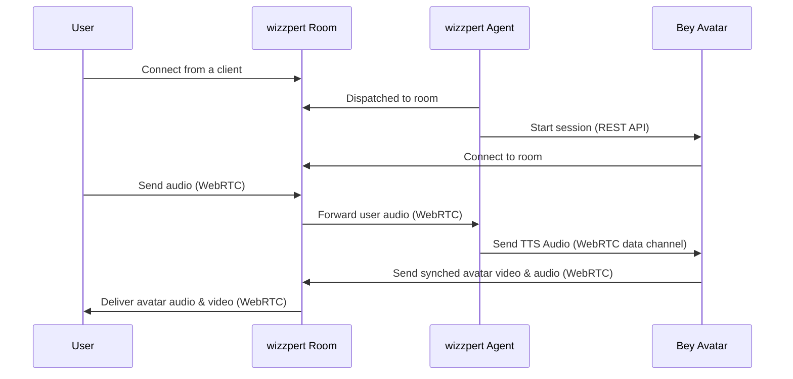

# wizzpert Beyond Presence Avatar Example

This example demonstrates how to create an animated avatar using Beyond Presence that responds to audio input using wizzpert's agent system.
The avatar worker generates synchronized video and audio based on received audio input using the Beyond Presence API.

## How it Works

1. The wizzpert agent and the Beyond Presence avatar worker both join into the same wizzpert room as the user.
2. The wizzpert agent listens to the user and generates a conversational response, as usual.
3. However, instead of sending audio directly into the room, the agent sends the audio via WebRTC data channel to the Beyond Presence avatar worker.
4. The avatar worker only listens to the audio from the data channel, generates the corresponding avatar video, synchronizes audio and video, and publishes both back into the room for the user to experience.

## Detailed Call Flow



## Usage

* Update the environment:

```bash
# Beyond Presence Config
export BEY_API_KEY="..."

# OpenAI config (or other models, tts, stt)
export OPENAI_API_KEY="..."

# wizzpert config
export wizzpert_API_KEY="..."
export wizzpert_API_SECRET="..."
export wizzpert_URL="..."
```

* Start the agent worker:

```bash
# You can specify a different avatar if you want
# export BEY_AVATAR_ID=your-avatar-id
python examples/avatar_agents/bey/agent_worker.py dev
```
